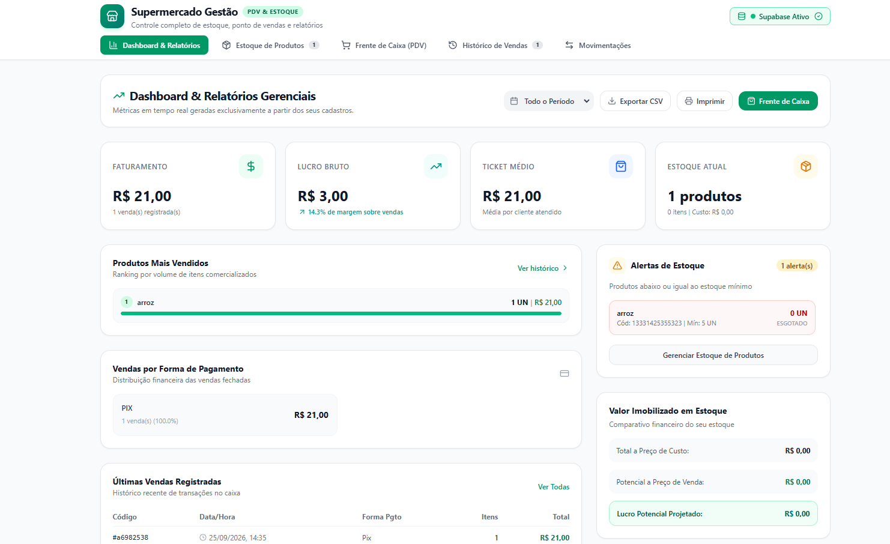

# 🛒 Supermercado Gestão — Estoque e Vendas

Sistema web de gestão para supermercados, desenvolvido para controlar estoque, registrar vendas e acompanhar informações através de um dashboard.

O projeto foi desenvolvido como parte de um curso de programação com Inteligência Artificial generativa, utilizando o **Google AI Studio / Gemini** como apoio durante o desenvolvimento.

🔗 **Demo:** https://sistema-de-mercados.vercel.app/

---

## ✨ Funcionalidades

- 📦 Cadastro e controle de produtos e estoque
- 🧾 Ponto de Venda (PDV) para registro de vendas
- 📊 Dashboard com informações de vendas e estoque
- 💾 Persistência dos dados utilizando Supabase
- 🔐 Integração com autenticação
- ⚡ Integração entre frontend, backend e banco de dados
- 🌐 Aplicação publicada na Vercel
- 🤖 Desenvolvimento com apoio de Inteligência Artificial

---

## 🖥️ Preview



---

## 🛠️ Tecnologias utilizadas

- **React** — construção da interface
- **TypeScript** — tipagem e organização do código
- **Vite** — desenvolvimento e configuração do projeto
- **Supabase** — backend, banco de dados e autenticação
- **Vercel** — deploy e hospedagem
- **Google AI Studio / Gemini** — apoio durante o desenvolvimento

---

## 📌 O que pratiquei

Durante o desenvolvimento deste projeto, pratiquei:

- Criação de prompts para orientar uma IA na construção de uma aplicação
- Leitura e entendimento de código gerado por Inteligência Artificial
- Desenvolvimento de interfaces utilizando React e TypeScript
- Integração de uma aplicação com banco de dados
- Criação e execução de um schema SQL
- Modelagem de tabelas para estoque e vendas
- Configuração de variáveis de ambiente
- Integração com Supabase
- Deploy de uma aplicação web utilizando Vercel
- Testes e validação da aplicação
- Identificação e correção de ajustes necessários no sistema

---

## 🚀 Como executar o projeto

### Pré-requisitos

Para executar o projeto localmente, é necessário ter:

- [Bun](https://bun.sh/) instalado
- Uma conta no [Supabase](https://supabase.com/)
- Um projeto criado no Supabase

### 1. Clone o repositório

```bash
git clone https://github.com/yasminalba/Sistema-de-mercados.git
cd Sistema-de-mercados
```

### 2. Instale as dependências

```bash
bun install
```

### 3. Configure o banco de dados

O arquivo `supabase-schema.sql` contém a estrutura das tabelas usadas pelo projeto. No painel do Supabase, vá em **SQL Editor** e execute o conteúdo desse arquivo para criar as tabelas necessárias.

### 4. Configure as variáveis de ambiente

Copie o arquivo de exemplo:

```bash
cp .env.example .env
```

Abra o `.env` e preencha com as credenciais do seu projeto Supabase (disponíveis em **Project Settings → API** no painel do Supabase):

```env
VITE_SUPABASE_URL=sua-url-aqui
VITE_SUPABASE_ANON_KEY=sua-chave-aqui
```

### 5. Execute o projeto

```bash
bun run dev
```

O app estará disponível em `http://localhost:5173` (ou na porta indicada no terminal).

---

## 📦 Deploy

O projeto está configurado para deploy automático na [Vercel](https://vercel.com/). Basta conectar o repositório e adicionar as mesmas variáveis de ambiente do `.env` nas configurações do projeto na Vercel.

---

## 📁 Estrutura do projeto

```
Sistema-de-mercados/
├── src/                    # Código-fonte da aplicação
├── index.html
├── metadata.json
├── package.json
├── supabase-schema.sql     # Estrutura do banco de dados
├── tsconfig.json
├── vite.config.ts
└── .env.example
```

---

## 📄 Licença

Este projeto está sob a licença MIT. Sinta-se à vontade para usar e adaptar.

---

Feito por [Yasmin Alba](https://github.com/yasminalba) 💜
